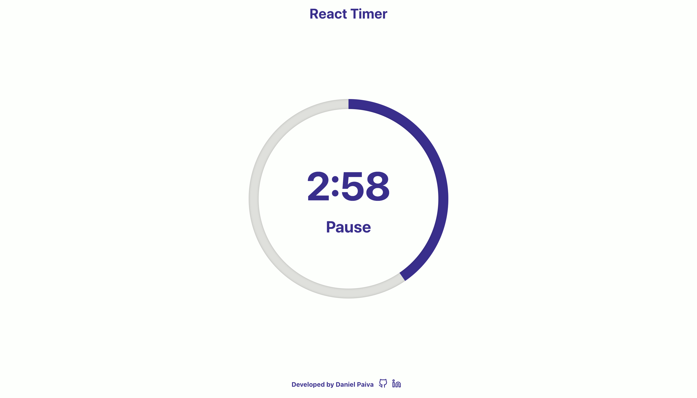

# My Calendar

<p align="center">
  
</p>

<p align="center">
The project is deployed and can be 
 <a href="https://basic-timer.vercel.app/">accessed here!</a>
</p>

## Getting Started

This project a simple 5 minute timer application.

## Instructions

- Click 'Start' to start the timer.
- Click 'Pause' to pause the timer.
- Click 'Reset' to reset the timer.

### Built With:

- [React](https://reactjs.org/) - A JavaScript library for building user interfaces.
- [Styled Components](https://styled-components.com/) - A library for React and React Native that allows you to use component-level styles in your application.
- [Vercel](https://vercel.com/) - Cloud platform where the project is deployed.

### Installation

1. Clone the repository.

```sh
git clone https://github.com/danielcspaiva/Basic-Timer.git
```

2. Install packages.

```sh
yarn install || npm install
```

3. Run the app.

```sh
yarn start || npm start
```

4. Open [http://localhost:3000](http://localhost:3000) to view it in the browser.

---

Built by Daniel - [email](mailto:danielcspaiva@gmail.com) - [linkedin](https://www.linkedin.com/in/danielcspaiva/)